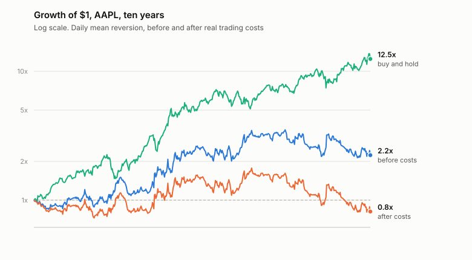
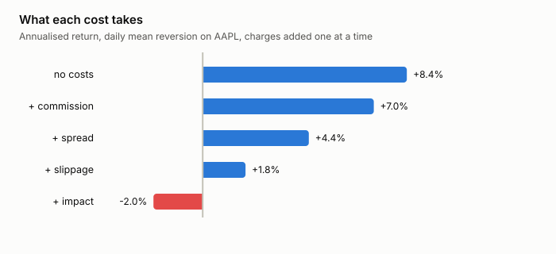

# honest-backtest

[](https://github.com/FinnTech3/honest-backtest/actions/workflows/ci.yml)

Tests a trading strategy against ten years of real prices, then charges it for
everything a real trade would actually have cost — and watches most of the
profit disappear.

## What this is

It is easy to write a program that says a trading strategy would have made
money. Give it historical prices, have it buy and sell on some rule, add up the
result. Almost every such program flatters the strategy, and usually in the same
few ways.

It assumes you bought at the closing price on the day you decided to buy — which
you could not have, because you did not know the closing price until the close.
It assumes trading is free. It assumes that when you decided to sell 50,000
shares, someone was waiting to take all 50,000 at the price on the screen.

None of that is true, and the gap between the flattering version and the honest
one is not a rounding error. It is usually the entire result.

This backtester makes each of those assumptions explicit, then lets you switch
them off one at a time and watch what happens.

## What I found

Two things, and the second surprised me more.

### High turnover does not survive contact with costs

Daily mean reversion — buy after a down day, sell after an up day — on Apple,
ten years:

```
assumption                  ann. return   sharpe   max DD  cost drag
fill at decision close             0.8%     0.17    48.3%      0.0%
  (not achievable)
no costs at all                    8.4%     0.42    40.0%      0.0%
+ commission                       7.0%     0.38    41.6%     23.7%
+ half spread                      4.4%     0.29    45.8%     61.5%
+ slippage                         1.8%     0.21    49.8%     88.8%
+ market impact                   -2.0%     0.08    54.9%    113.8%
buy and hold                      28.8%     1.02    38.5%      0.0%
```

<picture>
  <source media="(prefers-color-scheme: dark)" srcset="docs/figures/equity-dark.svg">
  
</picture>

It earns 8.4% a year before costs and loses 2.0% after them. The strategy turns
over **2,853 times** its starting capital across the period, and the charges
come to **114%** of everything you started with. You would have paid more in
costs than you invested.

<picture>
  <source media="(prefers-color-scheme: dark)" srcset="docs/figures/costs-dark.svg">
  
</picture>

Nothing here is an exotic assumption. Commission is half a basis point, the
spread is one, slippage is one. The charge that does the damage is market
impact — your own order pushing the price against you — and it is the one
missing from every naive backtest.

Across four symbols with all costs applied, three of the four lose money:

```
symbol      ann. return   sharpe   trades  cost drag
AAPL             -2.0%     0.08     1260    113.8%
MSFT              4.6%     0.30     1299    250.5%
KO              -15.7%    -0.77     1273     72.0%
SPY              -7.7%    -0.36     1261     45.3%
```

Microsoft is positive, and I do not believe it. Its cost drag is 250% — the
strategy paid two and a half times the starting capital in charges and came out
ahead anyway. That is what a lucky path looks like, not an edge.

### Low turnover survives the costs and still loses to doing nothing

Fifty-day momentum trades far less, so the charges barely register:

```
assumption                  ann. return   sharpe
no costs at all                   15.9%     0.85
+ market impact (all costs)       15.2%     0.82
buy and hold                      28.8%     1.02
```

Costs took 16% rather than 114%. The strategy is perfectly tradeable. It also
returns roughly half what you would have got by buying Apple in 2016 and never
looking at it again.

One window proves nothing, though — 50 days was a number I picked. Sweeping it:

```
 window  ann. return   sharpe  trades  vs buy & hold
     10       16.0%     0.87     392        -12.8%
     20       26.1%     1.29     198         -2.8%
     30       22.0%     1.14     168         -6.8%
     50       15.2%     0.82     146        -13.6%
    100       13.8%     0.71     107        -15.0%
    200       15.3%     0.72      53        -13.5%
buy and hold  28.8%
```

Ten windows tried, none beat buy and hold. That makes the 50-day figure
representative rather than an unlucky pick.

The 20-day row is the one worth staring at. A 26.1% annual return at a Sharpe
of 1.29 would read very well quoted on its own — and it is still behind doing
nothing, and it is the winner of ten attempts. **Reporting the best parameter
from a sweep is itself a bias**, and running the sweep is how you catch
yourself doing it.

This is the more useful finding. Killing a strategy with transaction costs is a
well-known result. The thing worth internalising is that surviving them is not
the bar — the bar is beating the thing you would have done otherwise, and a
backtest that never runs the benchmark will never tell you that it failed.

### What a look-ahead bug looks like

```
                                          ann. return   sharpe
decide on close, fill at that close              0.8%     0.17
decide on close, fill at next open               8.4%     0.42
read tomorrow's price (a real bug)             726.0%     8.47
```

The bottom row is one off-by-one in a shifted column. 726% a year, Sharpe 8.47.
Worth knowing the shape, because if a result ever looks like that, this is why —
nothing else produces it.

The top two rows are more interesting than I expected. They differ only in when
the fill lands, and the impossible one is *worse*. The gap between them is the
overnight move, and for a strategy trading daily reversal that move runs against
the signal. **Look-ahead bias does not reliably inflate a result. It distorts
it**, and which direction depends on what the strategy is trading. I had assumed
it would always flatter, and the data says otherwise.

## Using it

```sh
git clone https://github.com/FinnTech3/honest-backtest
cd honest-backtest
pip install -e ".[dev]"
```

```sh
honestbt waterfall                      # add one honest assumption at a time
honestbt lookahead                      # what the timing errors do alone
honestbt universe                       # the honest run across four symbols
honestbt sensitivity                    # sweep the parameter, don't trust one value
honestbt --strategy momentum waterfall  # a slower strategy, for contrast
```

Ten years of daily bars for four symbols are committed to `tests/fixtures`, so
everything runs offline and the numbers above reproduce exactly.

## How it works

### The day is split at the open

This is the part that took two attempts. A backtest that applies close-to-close
returns and simply *records* a fill price produces identical results whether it
fills at today's close or tomorrow's open. The fill price never touches the
profit, so the entire look-ahead comparison silently measures nothing. My first
engine did exactly this, and the two execution modes agreed to the last decimal
place — which looked like the modes being equivalent rather than the code being
broken.

So each session is two legs. A day earns an **overnight** return from the
previous close to today's open, and an **intraday** return from today's open to
today's close. A fill at the open lands between them: the position going in
earns the gap, the position afterwards earns the rest. That is the only way the
timing choice can affect anything, and there is a test asserting the two modes
disagree.

### Adjusted prices for returns, real prices for fills

Every bar carries a close and an adjusted close. The adjusted one gives correct
returns across dividends and splits; it is also a price at which nothing ever
traded. Apple's adjusted close for August 2016 is $24.23 and nobody bought Apple
at $24.23 in 2016.

I checked what the difference actually contains rather than assuming, and it is
worth checking: **Yahoo's chart API already adjusts its OHLC for splits.**
Apple's four-for-one in August 2020 does not appear as a cliff — the close runs
124.81 to 129.04 straight through it. Only dividends separate the two columns
here. A feed that does *not* pre-adjust makes fill pricing wrong by the whole
split ratio, so `Series.looks_split_adjusted()` exists to find out which kind you
have.

### Impact grows with the square root of size

Commission, spread and slippage are flat charges in basis points. Market impact
is not: it scales with the square root of how much of the day's volume you are,
which is the standard result and the reason size hurts more than people expect.
Ten percent of a day's volume costs about a third of the full-participation
charge, not a tenth.

## Decisions and trade-offs

**Costs are in basis points, not modelled per venue.** A real cost model
depends on the instrument, the time of day, the order type and the broker.
Basis points are a defensible simplification for ranking assumptions against
each other and not for pricing an actual trade.

**No shorting constraints, no borrow cost, no margin.** The mean reversion
strategy goes short half the time and pays nothing for the privilege, which
flatters it further. Adding borrow costs would make the result worse, not
better, so the conclusion survives — but the number would move.

**Four symbols, all of which still exist.** This is survivorship bias and I have
not fixed it, only labelled it. A universe of companies that lasted ten years is
not the universe you would have picked from in 2016. Doing this properly needs a
point-in-time constituent list, which is not free.

**The risk-free rate is zero.** With cash paying 5%, a strategy earning 4% has a
negative excess return and the Sharpe here would report it as positive.

**Daily bars.** Nothing intraday, so the fill model is coarse — the open is one
price and real execution is a schedule.

## Testing

34 tests, all offline against committed fixtures.

The regressions are the valuable ones, because each is a bug that produced a
plausible answer rather than an error:

- the two execution modes must produce different equity curves
- an overnight gap accrues to the position held *into* it, not the one taken at
  the open
- a constant return series has a Sharpe of zero, not 2.4 × 10¹⁶ (its variance is
  about 1e-19, so an `== 0` guard misses and the division runs anyway)
- signals return the same value whether or not future bars exist
- the feed is checked to be split-adjusted rather than assumed to be

## What I would do differently

**Point-in-time universes.** The survivorship problem is the biggest hole and
the only one I have labelled rather than solved.

**Model the borrow.** Short positions are free here and are not in reality.

**Intraday fills.** A single open price stands in for what would really be a
schedule, and for a strategy trading this often the difference matters.

**Sweep the mean reversion side too.** `sensitivity` sweeps the momentum
window; the reversal lookback is still a single number I chose.

## Sources

Prices from the Yahoo Finance chart API. See [docs/SOURCES.md](docs/SOURCES.md).

## License

MIT. See [LICENSE](LICENSE).
